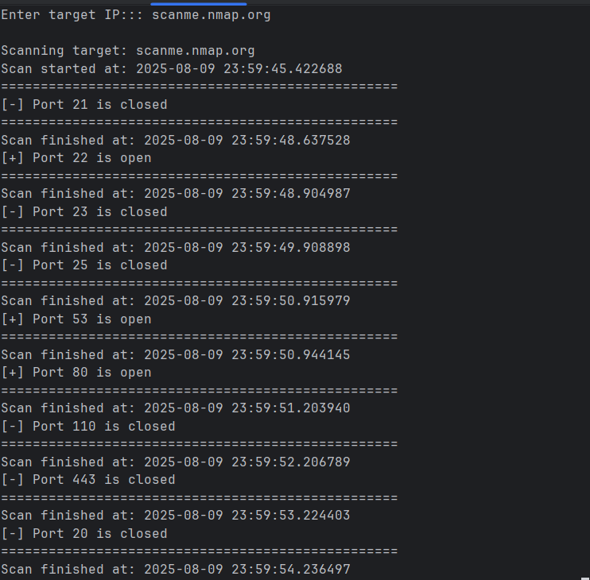

# Basic Port Scanner

## 📌 Overview
A simple Python TCP port scanner designed to learn the basics of networking with Python sockets.

---

## 🚀 Features
- Scans a fixed list of common ports
- Detects open/closed ports
- Single-threaded

---

## 🛠 Usage
```bash
python netscan.py
```
# Example Output

