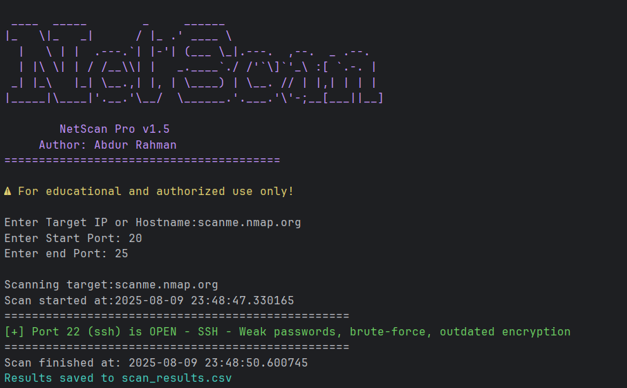
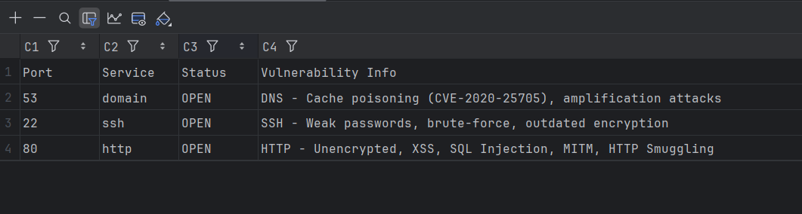

# NetScan Pro – Advanced Port & Vulnerability Scanner

## 📌 Overview
A Python-based multi-threaded port scanner with built-in vulnerability information, CSV reporting, and colorful output.

---

## 🚀 Features
- Custom port range scanning
- Service detection
- Vulnerability database mapping
- Multithreading for performance
- Color-coded results
- CSV export

---

## 🛠 Usage
```bash
python netscan_Pro.py
```

## Example


## CSV
